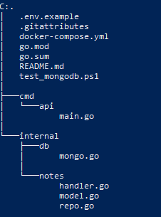
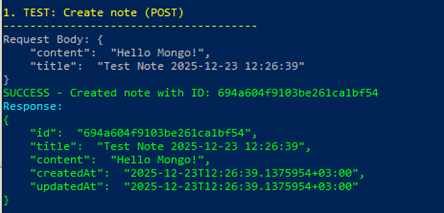
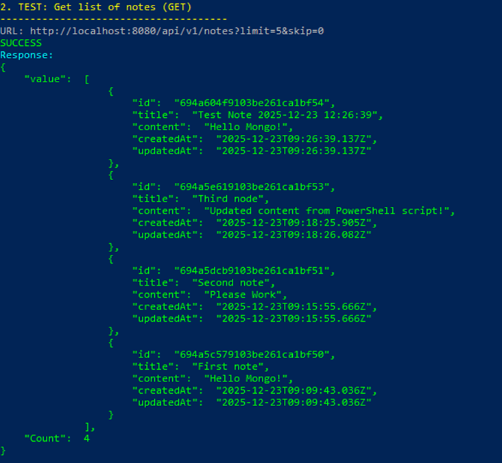
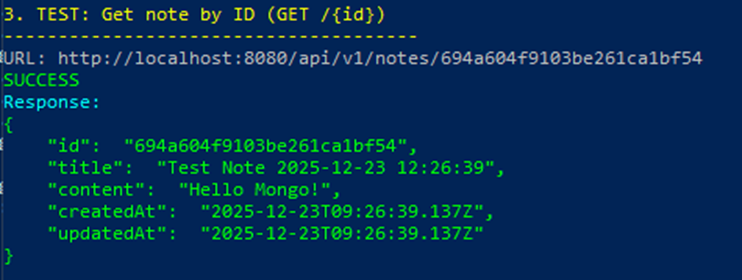
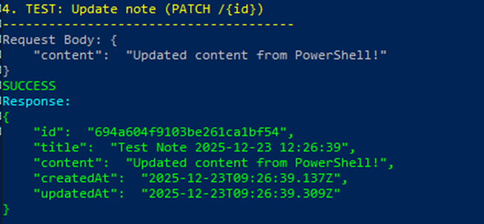

# Практическое задание 8

## ЭФМО-02-25 Мишкин Артём Дмитриевич 23.12.2025

---

## Информация о проекте

REST API на Go с использованием MongoDB для управления заметками. Реализация полного набора CRUD-операций (Create, Read, Update, Delete)

## Цели занятия

- Освоить базовые операции работы с MongoDB из Go-приложения
- Научиться создавать коллекции, индексы и реализовывать CRUD-операции
- Реализовать фильтрацию и пагинацию данных
- Понять различия между документной и реляционной моделями данных
- Отработать обработку ошибок при работе с асинхронными операциями БД

## Файловая структура проекта



## ВАЖНОЕ ПРИМЕЧАНИЕ

- **Порт сервера**: 8080
- **MongoDB**:  — 27017
- **База данных**: pz8
- **Коллекция**: notes
- **Аутентификация**: root:secret (через authSource=admin)


## Примеры запросов (PowerShell)

### 1. Создание заметки

```powershell
$apiUrl = "http://localhost:8080/api/v1/notes"
$headers = @{ "Content-Type" = "application/json" }

$createBody = @{
    title   = "My First Note"
    content = "This is a test note"
} | ConvertTo-Json

$response = Invoke-WebRequest -Uri $apiUrl -Method POST -Headers $headers -Body $createBody
$noteId = ($response.Content | ConvertFrom-Json).id
```


### 2. Получение списка заметок

```powershell
$listUrl = $apiUrl + "?limit=5&skip=0"
Invoke-WebRequest -Uri $listUrl -Method GET | ForEach-Object { $_.Content | ConvertFrom-Json | ConvertTo-Json }
```




### 3. Получение заметки по ID

```powershell
$getUrl = $apiUrl + "/" + $noteId
Invoke-WebRequest -Uri $getUrl -Method GET | ForEach-Object { $_.Content | ConvertFrom-Json | ConvertTo-Json }
```



### 4. Обновление заметки

```powershell
$updateBody = @{
    content = "Updated content"
} | ConvertTo-Json

Invoke-WebRequest -Uri "$apiUrl/$noteId" -Method PATCH -Headers $headers -Body $updateBody
```



### 5. Удаление заметки

```powershell
Invoke-WebRequest -Uri "$apiUrl/$noteId" -Method DELETE
```


## Запуск проекта

### Запуск MongoDB через Docker

```bash
docker-compose up -d
```

### Запуск API сервера

```powershell
cd pz8-mongo
go run ./cmd/api
```

### Проверка здоровья сервера

```powershell
curl -s http://localhost:8080/health
```

## Индексы в MongoDB

Проект создаёт уникальный индекс на поле `title`:

```go
_, err := col.Indexes().CreateOne(context.Background(), mongo.IndexModel{
    Keys: bson.D{{Key: "title", Value: 1}},
    Options: options.Index().SetUnique(true),
})
```

**Следствие**: невозможно создать две заметки с одинаковым заголовком (HTTP 409 — Conflict).

## Контрольные вопросы

### 1. Чем документная модель MongoDB принципиально отличается от реляционной?

**MongoDB (документная)**:
- Хранит данные в JSON-подобных документах (BSON)
- Нет жёсткой схемы — документы могут иметь разные структуры
- Вложенные объекты хранятся прямо в документе (нет необходимости в JOIN)
- Масштабируется горизонтально через sharding

**PostgreSQL (реляционная)**:
- Данные в строгих таблицах с фиксированной схемой
- Связи между таблицами через внешние ключи и JOIN
- Требует нормализацию для избежания дублирования
- Лучше для сложных транзакций и целостности данных

### 2. Что такое ObjectID и зачем нужен _id? Как корректно парсить/валидировать его в Go?

**ObjectID** — это 12-байтовый уникальный идентификатор, автоматически генерируемый MongoDB:
- 4 байта — временная метка (время создания)
- 5 байт — машинный ID
- 3 байта — счётчик (последовательное число)

**Парсинг в Go**:
```go
import "go.mongodb.org/mongo-driver/bson/primitive"

oid, err := primitive.ObjectIDFromHex(hexString)
if err != nil {
    // Некорректный формат ID
}
```

**Валидация**: используйте `ObjectIDFromHex()` с проверкой ошибки перед использованием.

### 3. Какие операции CRUD предоставляет драйвер MongoDB и какие операторы обновления вы знаете?

**CRUD-операции**:
- `InsertOne()` / `InsertMany()` — создание документов
- `FindOne()` / `Find()` — чтение документов
- `UpdateOne()` / `UpdateMany()` — обновление документов
- `DeleteOne()` / `DeleteMany()` — удаление документов

**Операторы обновления**:
- `$set` — установить значение поля
- `$inc` — увеличить значение на число
- `$push` — добавить элемент в массив
- `$pull` — удалить элемент из массива
- `$unset` — удалить поле из документа

Пример:
```go
update := bson.M{
    "$set": bson.M{
        "content": "новый текст",
        "updatedAt": time.Now(),
    },
}
```

### 4. Как устроены индексы в MongoDB? Как создать уникальный индекс и чем он грозит при вставке?

**Индексы в MongoDB**:
- Ускоряют поиск и сортировку по полям
- Могут быть одиночными, составными, текстовыми, TTL и др.
- Хранятся отдельно от данных и автоматически обновляются

**Создание уникального индекса**:
```go
col.Indexes().CreateOne(ctx, mongo.IndexModel{
    Keys: bson.D{{Key: "title", Value: 1}},
    Options: options.Index().SetUnique(true),
})
```

**Последствия**: при вставке документа с дублирующимся значением ключа возвращается ошибка E11000 (duplicate key error). HTTP-ответ: 409 Conflict.

### 5. Почему важно использовать context.WithTimeout при вызовах к БД? Что произойдет при его срабатывании?

**Значение context.WithTimeout**:
- Предотвращает бесконечное зависание при сетевых ошибках
- Позволяет контролировать максимальное время ожидания
- Освобождает ресурсы автоматически по истечении таймаута

**При срабатывании таймаута**:
- Операция отменяется
- Возвращается ошибка `context.DeadlineExceeded`
- В коде обрабатывается как любая другая ошибка БД
- HTTP-ответ: 500 Internal Server Error

Пример из кода:
```go
ctx, cancel := context.WithTimeout(r.Context(), 5*time.Second)
defer cancel()

n, err := h.repo.ByID(ctx, id)
```

## Коды ответа API

| Код | Смысл | Когда |
|-----|-------|-------|
| 200 OK | Успешно | GET, PATCH успешно выполнены |
| 201 Created | Создано | POST (создание заметки) |
| 204 No Content | Удалено | DELETE успешно |
| 400 Bad Request | Ошибка данных | Отсутствует title, некорректный JSON |
| 404 Not Found | Не найдено | Заметка с таким ID не существует |
| 409 Conflict | Конфликт | Дублирующееся значение title (уникальный индекс) |
| 500 Internal Server Error | Ошибка сервера | Проблемы с подключением к MongoDB, таймаут |

## Тестирование в PowerShell

Для удобного тестирования всех операций используйте готовый скрипт `test_api.ps1`, который последовательно:
1. Создаёт заметку с уникальным заголовком (временная метка)
2. Получает список заметок
3. Получает заметку по ID
4. Обновляет содержимое
5. Удаляет заметку
6. Проверяет, что заметка удалена (404)


```powershell
.\test_api.ps1
```


## Типовые ошибки

| Ошибка | Причина | Решение |
|--------|---------|--------|
| connection refused | MongoDB не запущена | `docker-compose up -d` |
| E11000 duplicate key | Заголовок уже существует | Используйте уникальные заголовки |
| invalid ObjectID | Некорректный формат ID | Проверьте формат 24-символьной hex-строки |
| context deadline exceeded | Таймаут при операции | Увеличьте timeout или проверьте подключение |
| authorization failed | Ошибка аутентификации | Проверьте MONGO_URI и учётные данные root:secret |
